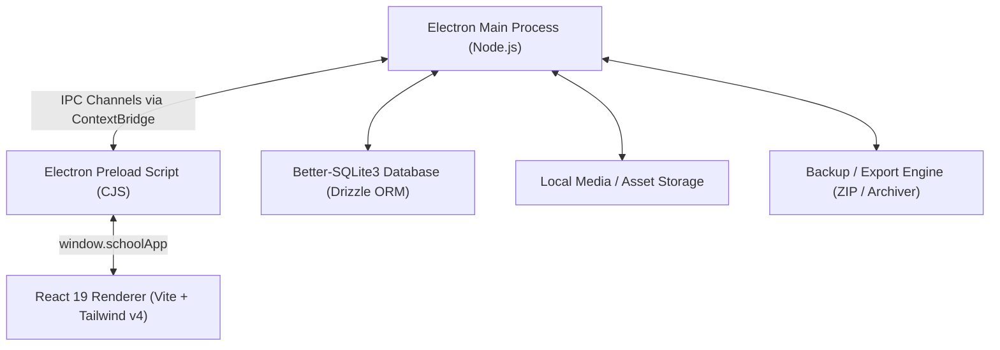

# Edupilot DZ — Complete Project & Technical Documentation

> **System Overview**: Offline-first, enterprise-grade Desktop School Management System tailored for educational centers in Algeria (*Edupilot DZ*). Built with Electron, React 19, TypeScript, Vite, Tailwind CSS v4, and Better-SQLite3 with Drizzle ORM.

---

## 📐 1. System Architecture & Tech Stack

### Core Technologies
- **Desktop Shell**: [Electron 32](file:///d:/Projects/school-management-Desktop-app/package.json#L68)
- **UI Framework**: [React 19](file:///d:/Projects/school-management-Desktop-app/package.json#L43) + [React Router 7](file:///d:/Projects/school-management-Desktop-app/package.json#L47)
- **Styling**: [Tailwind CSS v4](file:///d:/Projects/school-management-Desktop-app/package.json#L74) + Lucide Icons
- **Build Tooling**: [electron-vite](file:///d:/Projects/school-management-Desktop-app/electron.vite.config.ts) + [TypeScript 5.7](file:///d:/Projects/school-management-Desktop-app/tsconfig.json)
- **Database Engine**: Better-SQLite3 with Drizzle ORM ([schema.ts](file:///d:/Projects/school-management-Desktop-app/src/main/database/schema.ts))
- **Localization**: i18next ([AR / FR / EN](file:///d:/Projects/school-management-Desktop-app/src/renderer/i18n/i18n.ts))
- **Packaging**: [electron-builder](file:///d:/Projects/school-management-Desktop-app/electron-builder.yml) producing standalone Windows `.exe` installers.

---

## 🗄️ 2. Database Schema Reference

The system relies on SQLite located in user data, structured with Drizzle ORM in [`src/main/database/schema.ts`](file:///d:/Projects/school-management-Desktop-app/src/main/database/schema.ts):

| Table Name | Description | Key Fields & Constraints |
| :--- | :--- | :--- |
| **`users`** | Admin accounts | `id`, `username`, `passwordHash`, `role`, `pinCode`, `status` |
| **`students`** | Student master records | `id`, `studentNumber`, `firstNameAr`, `lastNameAr`, `firstNameFr`, `lastNameFr`, `phone`, `dateOfBirth`, `address`, `guardianName`, `guardianPhone`, `guardianRelationship`, `photoPath`, `qrToken`, `qrTokenActive`, `status` (`active`/`archived`) |
| **`teachers`** | Teacher profiles | `id`, `firstName`, `lastName`, `courseId` *(foreign key to courses — 1 teacher = 1 module)*, `phone`, `email`, `address`, `photoPath`, `status` |
| **`courses`** | Subject modules | `id`, `nameAr`, `nameFr`, `nameEn`, `descriptionAr`, `descriptionFr`, `defaultPrice`, `status` |
| **`groups`** | Student study groups | `id`, `courseId`, `teacherId`, `name`, `capacity`, `monthlyPrice`, `startDate`, `endDate`, `room`, `status` |
| **`enrollments`** | Group registrations | `id`, `studentId`, `groupId`, `agreedPrice`, `enrollmentDate`, `status` (`active`/`inactive`/`completed`) |
| **`schedules`** | Weekly timetable slots | `id`, `groupId`, `weekday` (0-6), `startTime`, `endTime`, `room`, `isActive` |
| **`attendance_sessions`** | Specific lesson instances | `id`, `groupId`, `sessionDate`, `plannedStartTime`, `endTime`, `room`, `teacherId`, `price`, `sessionType` (`regular`/`extra`), `status` (`open`/`closed`/`cancelled`) |
| **`attendance_records`** | Student session status | `id`, `sessionId`, `studentId`, `attendanceStatus` (`present`/`absent`/`late`/`not_active`), `scannedAt`, `source` |
| **`payments`** | Receipts & transactions | `id`, `studentId`, `enrollmentId`, `billingPeriod`, `amount`, `paymentMethod` (`cash`/`transfer`/`ccp`), `paymentDate`, `receiptNumber`, `status` (`paid`/`cancelled`) |
| **`settings`** | App parameters | `key` (primary), `value` |

---

## 🖥️ 3. Detailed Page-by-Page Documentation

Every page in [`src/renderer/pages`](file:///d:/Projects/school-management-Desktop-app/src/renderer/pages) is detailed below with its purpose, UI components, file links, and key workflows.

---

### 🔑 1. Setup Page
- **File**: [`src/renderer/pages/Setup.tsx`](file:///d:/Projects/school-management-Desktop-app/src/renderer/pages/Setup.tsx)
- **Purpose**: Initial application bootstrap for first-time installation.
- **Key Features**:
  - Administrator registration form (Username, Password, PIN code confirmation).
  - School profile configuration (School Name in Arabic & French, Contact Phone, City/Address).
  - Automatic database initialization and admin session creation.
- **UX & Logic**: Shown automatically when no admin user exists in SQLite database. Directs user to Dashboard upon completion.

---

### 🔒 2. Login Page
- **File**: [`src/renderer/pages/Login.tsx`](file:///d:/Projects/school-management-Desktop-app/src/renderer/pages/Login.tsx)
- **Purpose**: Secure authentication portal for staff and administrators.
- **Key Features**:
  - Dual authentication mode: Full Password OR Quick 4-digit PIN Code.
  - Brute-force protection: Automatic account lockout after consecutive failed attempts.
  - Language toggle (AR / FR / EN) on login screen.
  - Session persistence and auto-lock state handling.

---

### 📊 3. Dashboard Page
- **File**: [`src/renderer/pages/Dashboard.tsx`](file:///d:/Projects/school-management-Desktop-app/src/renderer/pages/Dashboard.tsx)
- **Purpose**: Central control hub providing high-level KPIs, live session triggers, and the Interactive Weekly Spreadsheet Schedule.
- **Key Features**:
  - **KPI Summary Cards**: Active Students count, Total Teachers, Total Groups, Monthly Income summary, Today's Scheduled Sessions.
  - **Interactive Weekly Spreadsheet Schedule Table**:
    - Spreadsheet layout with Days of the week as column headers (Saturday through Friday) and Time slots as row headers.
    - Session containers rendered directly at their starting hour slot.
    - Deep nested detail view: Module name -> Teacher name -> Exact session time.
    - Hierarchical filter bar: **Module Filter** -> **Teacher Filter** -> **Group Filter** with instant text searching and a **Reset Filters** button.
    - Direct session drilldown: Clicking any schedule card navigates directly to the live attendance Terminal for that exact session.
  - **Today's Live Sessions Panel**: Quick actions to launch live attendance scanner, view student rosters, or start unscheduled extra sessions.
  - **Quick Action Bar**: Shortcuts for registering new students, collecting payments, or generating reports.

---

### 👥 4. Students Page
- **File**: [`src/renderer/pages/Students.tsx`](file:///d:/Projects/school-management-Desktop-app/src/renderer/pages/Students.tsx)
- **Purpose**: Master directory for searching, filtering, and managing student registrations.
- **Key Features**:
  - **Hierarchical Combobox Filter**:
    - **Module Combobox**: Selects subject module with searchable text.
    - **Teacher Combobox**: Auto-filters teachers belonging to selected module.
    - **Group Combobox**: Displays groups under selected teacher & module.
    - **Bi-directional Auto-fill**: Selecting a Group automatically auto-populates Teacher and Module fields.
  - **Payment Status Filter**: Toggle between **All Students**, **Paid (0 DA Debt)**, and **In-Debt (Negative Balance)**.
  - **Status Tabs**: Active Students tab vs. Archived Students tab.
  - **Search & Pagination**: Live searching by name (Arabic or Latin), matricule number, or phone number.
  - **Student Cards & List View**: Displays photo, student matricule, enrolled modules count, debt badges, and quick link to full Student Profile.

---

### 📝 5. Student Form Page (Add / Edit)
- **File**: [`src/renderer/pages/StudentForm.tsx`](file:///d:/Projects/school-management-Desktop-app/src/renderer/pages/StudentForm.tsx)
- **Purpose**: Registration and editing modal/form for individual student records.
- **Key Features**:
  - **Bilingual Identity Input**: Arabic First/Last Name and French/Latin First/Last Name.
  - **Numeric Normalization**: Converts Eastern Arabic (٠-٩) and Persian (۰-۹) digits into standard ASCII numbers in real-time (`normalizeNumberInput`).
  - **Contact & Demographics**: Phone number, Date of Birth, Home Address.
  - **Guardian & Tuteur Section**: Guardian Name, Phone, and Family Relationship (Father, Mother, Uncle, etc.).
  - **Photo Upload & Cropping**: Profile picture selection via local file dialog.
  - **Initial Group Enrollment**: Option to immediately enroll student into an active study group upon creation.

---

### 👤 6. Student Profile Page (360° Student Hub)
- **File**: [`src/renderer/pages/StudentProfile.tsx`](file:///d:/Projects/school-management-Desktop-app/src/renderer/pages/StudentProfile.tsx)
- **Purpose**: Detailed individual student management dashboard containing financial balances, module enrollments, attendance audit logs, and identity cards.
- **Key Features**:
  - **Profile Summary Header**: Profile photo, QR token status badge, matricule number, contact info, and overall debt/paid badge.
  - **Per-Enrollment Credit Tracking**: Displays financial balance (`+Balance` or `Debt`) and remaining session counters for each group enrollment separately.
  - **Module Active/Inactive Toggle**: Allows administrators to toggle a student's status per module between **Active** and **Inactive** (suspended). Inactive modules block attendance deductions.
  - **Credit Transfer Modal**: Enables transferring unused financial balance from one course/group to another (e.g., when a student stops Mathematics to take Physics instead), with optional group closure.
  - **Session History Audit Log**:
    - Complete chronological log of all past sessions for the student.
    - Real-time attendance status override buttons: **Present**, **Late**, **Absent**, and **Not Active**.
    - **Automated Refund Engine**: Marking a session as `Not Active` automatically refunds the session cost back to the student's group credit balance.
  - **Identity & QR Card Generator**: Real-time rendering of QR code canvas containing full student payload, with instant **Regenerate QR Token** trigger.
  - **Notes & Administrative Log Timeline**: Add and view internal admin notes with timestamp and administrator username.
  - **Student Archive / Restore Actions**: Safe archiving and one-click restoration with QR re-activation.

---

### 🪪 7. Student Card Page
- **File**: [`src/renderer/pages/StudentCard.tsx`](file:///d:/Projects/school-management-Desktop-app/src/renderer/pages/StudentCard.tsx)
- **Purpose**: Printable student identity card and QR badge generator.
- **Key Features**:
  - High-resolution vector QR code containing matricule, full bilingual name, and encrypted token.
  - School logo and customized branding headers.
  - Single card print mode vs. Batch multi-student card layout.
  - Direct print triggers formatted for standard ID card PVC dimensions.

---

### 👨‍🏫 8. Teachers Page
- **File**: [`src/renderer/pages/Teachers.tsx`](file:///d:/Projects/school-management-Desktop-app/src/renderer/pages/Teachers.tsx)
- **Purpose**: Faculty directory and teacher-subject assignment.
- **Key Features**:
  - **Single-Module Binding**: Enforces business rule where each teacher profile is strictly associated with exactly **1 subject module** (e.g. Prof. Ahmed teaches Mathematics).
  - Teacher creation & modification modal: Name, phone, email, assigned course module, photo upload.
  - Course filter to view teachers by module.
  - Teacher status toggles (Active / Inactive / Archived).

---

### 📚 9. Courses & Groups Page
- **File**: [`src/renderer/pages/Courses.tsx`](file:///d:/Projects/school-management-Desktop-app/src/renderer/pages/Courses.tsx)
- **Purpose**: Subject module repository, group builder, and timetable recurring schedule planner.
- **Key Features**:
  - **Subject Module Management**: Create/Edit courses (Arabic Name, French Name, Default Monthly Price, Description).
  - **Group Management**:
    - Create study groups under specific courses and assigned teachers.
    - Set custom monthly price, student capacity limit, start/end dates, and classroom room number.
  - **Weekly Timetable Builder**: Add recurring weekly timetable slots (Weekday, Start Time, End Time, Room).
  - **Extra Session Scheduler**: Schedule one-off extra sessions with custom prices or free sessions.
  - **Session Cancellation Engine**: Cancel scheduled sessions with automatic voiding of attendance records and financial refunds to enrolled students.

---

### ⏱️ 10. Attendance Terminal Page
- **File**: [`src/renderer/pages/Attendance.tsx`](file:///d:/Projects/school-management-Desktop-app/src/renderer/pages/Attendance.tsx)
- **Purpose**: Live session roster and barcode/QR scanner terminal.
- **Key Features**:
  - **Live QR Reader Engine**: Supports USB hardware barcode scanners and webcam scanning.
  - **Instant Audio Feedback**: Success beep for valid check-ins, error beep for inactive/unregistered cards.
  - **Manual Lookup**: Instant search by student matricule or partial student name.
  - **Session Roster View**: Real-time roster table displaying all enrolled students for the active session.
  - **Attendance Status Controls**: One-click toggles for **Present**, **Late**, **Absent**, and **Not Active**.
  - **Instant Debt Warnings**: Displays alert badge if scanned student is in debt or has 0 remaining sessions.

---

### 📜 11. Attendance History Page
- **File**: [`src/renderer/pages/AttendanceHistory.tsx`](file:///d:/Projects/school-management-Desktop-app/src/renderer/pages/AttendanceHistory.tsx)
- **Purpose**: Historical audit log of completed attendance sessions.
- **Key Features**:
  - Date range filtering and group filter.
  - Session statistics: Present percentage, total absent students, completed sessions.
  - Export capabilities for historical attendance logs.

---

### 💳 12. Payments Page
- **File**: [`src/renderer/pages/Payments.tsx`](file:///d:/Projects/school-management-Desktop-app/src/renderer/pages/Payments.tsx)
- **Purpose**: Financial cashier terminal for tuition collection and receipt issuance.
- **Key Features**:
  - **Payment Processing**: Record tuition payments per student enrollment with automated receipt number generation (`REC-XXXX`).
  - **Billing Period Selection**: Associate payments with specific billing months (`YYYY-MM`).
  - **Payment Methods**: Cash, Bank Transfer, CCP.
  - **Printable Payment Receipts**: Modal dialog rendering official school payment receipts with printable formatting.
  - **Payment Cancellation / Voiding**: Cancel payments with automatic balance adjustment.

---

### 📈 13. Reports Page
- **File**: [`src/renderer/pages/Reports.tsx`](file:///d:/Projects/school-management-Desktop-app/src/renderer/pages/Reports.tsx)
- **Purpose**: Executive analytics and business intelligence dashboard.
- **Key Features**:
  - Financial revenue charts (Monthly income breakdown, payment method distribution).
  - Outstanding Debt Overview: Detailed breakdown of students in debt per course module.
  - Enrolled Students Distribution: Group and course popularity statistics.
  - Attendance rate metrics across groups.

---

### ⚙️ 14. Settings Page
- **File**: [`src/renderer/pages/Settings.tsx`](file:///d:/Projects/school-management-Desktop-app/src/renderer/pages/Settings.tsx)
- **Purpose**: System configuration, security settings, and branding setup.
- **Key Features**:
  - School Profile Details: Arabic/French school names, phone, address, tax ID.
  - Branding Assets: Upload school logo for reports and identity cards.
  - Language Selection: Dynamic switching between **Arabic**, **French**, and **English**.
  - Security Settings: Change admin password and PIN code.
  - Auto-Lock Timeout: Configure idle lock timer duration.

---

### 💾 15. Backups Page
- **File**: [`src/renderer/pages/Backups.tsx`](file:///d:/Projects/school-management-Desktop-app/src/renderer/pages/Backups.tsx)
- **Purpose**: Database protection and disaster recovery hub.
- **Key Features**:
  - Automated & Manual SQLite Database Backups.
  - Export backup archives to `.zip` files.
  - One-click Database Restoration with safe connection reloading.
  - Backup history list with timestamps and file sizes.

---

## 🛠️ 4. Shared Components & Layout Elements

- [`src/renderer/components/layout/AppLayout.tsx`](file:///d:/Projects/school-management-Desktop-app/src/renderer/components/layout/AppLayout.tsx): Root layout wrapper with Sidebar and Header.
- [`src/renderer/components/layout/Sidebar.tsx`](file:///d:/Projects/school-management-Desktop-app/src/renderer/components/layout/Sidebar.tsx): Primary navigation bar with badge counters and active route highlights.
- [`src/renderer/components/layout/Header.tsx`](file:///d:/Projects/school-management-Desktop-app/src/renderer/components/layout/Header.tsx): Top bar with quick search, language switcher, auto-lock lock button, and current user avatar.
- [`src/renderer/components/AutoLock.tsx`](file:///d:/Projects/school-management-Desktop-app/src/renderer/components/AutoLock.tsx): Inactivity timer monitor locking application interface on idle timeout.
- [`src/renderer/components/Logo.tsx`](file:///d:/Projects/school-management-Desktop-app/src/renderer/components/Logo.tsx): Branding logo component rendering Edupilot DZ emblem.

---

## 🔌 5. Main Process Services & IPC Channels

| Service File | Primary Responsibilities | Handled IPC Channels |
| :--- | :--- | :--- |
| [`attendance.service.ts`](file:///d:/Projects/school-management-Desktop-app/src/main/services/attendance.service.ts) | Attendance marking, session creation, roster, session audit log | `attendance:startSession`, `attendance:scan`, `attendance:markManually`, `attendance:getSession`, `attendance:studentSessionHistory` |
| [`student.service.ts`](file:///d:/Projects/school-management-Desktop-app/src/main/services/student.service.ts) | Student CRUD, hierarchical filtering, QR regeneration | `students:list`, `students:getById`, `students:create`, `students:update`, `students:archive`, `students:regenQR` |
| [`payment.service.ts`](file:///d:/Projects/school-management-Desktop-app/src/main/services/payment.service.ts) | Financial balances, receipt generation, tuition payments | `payments:list`, `payments:create`, `payments:balance`, `payments:byStudent`, `payments:cancel` |
| [`entities.service.ts`](file:///d:/Projects/school-management-Desktop-app/src/main/services/entities.service.ts) | Teachers, Courses, Groups CRUD & group schedule generation | `teachers:list`, `teachers:create`, `courses:list`, `courses:create`, `groups:list`, `groups:create` |
| [`auth.service.ts`](file:///d:/Projects/school-management-Desktop-app/src/main/services/auth.service.ts) | Authentication, password hashing (Argon2), PIN code check | `auth:login`, `auth:checkPin`, `auth:logout`, `auth:setup` |
| [`backup.service.ts`](file:///d:/Projects/school-management-Desktop-app/src/main/services/backup.service.ts) | SQLite database backup generation & restoration | `backups:list`, `backups:create`, `backups:restore`, `backups:delete` |
| [`settings.service.ts`](file:///d:/Projects/school-management-Desktop-app/src/main/services/settings.service.ts) | Application key-value configuration storage | `settings:get`, `settings:update` |

---

## 📦 6. Packaging & Deployment

- **Config File**: [`electron-builder.yml`](file:///d:/Projects/school-management-Desktop-app/electron-builder.yml)
- **Target Output**: `release/EdupilotDZ-Setup-1.0.0.exe`
- **Build Command**: `npm run dist:win` (Executes Vite production build and packages NSIS installer).
